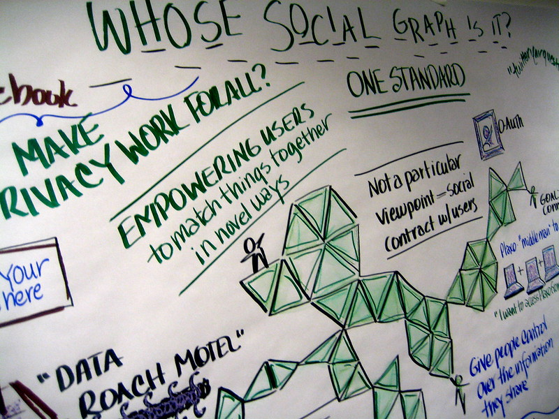

<!--
date_created: "2013-07-01"
-->

# Introduction to liquid organizations

Several years ago I decided to work after a big goal: to develop a participatory and organizational system for [Pirates de Catalunya](https://pirates.cat/en/). Its name, [Lýd](/lyd).

I had a one year permanent on-line assembly experience, physical assemblies, two electoral campaigns, many tips and ideas from my colleagues. Also I had acquired and shared knowledge in conversation with people of around the world.

I started the analysis, which lasted one year and a half, with two additional campaigns, hundred of work hours and more exchange of ideas with other collective’s colleagues. A time of compilation, writing and fine tuning of an idea to unleash the true power of any horizontal collective.

Until today, July 1st 2013. After several versions, analyzing the outcomes and looking after the most clear and concise one, I release the [analysis](/lyd) as online documentation, available to any collective. I ask you to enhance and improve it.

With this I set liquid organizations’ bases. But, what they are?

<figure>
    
    <figcaption>"<a href="https://secure.flickr.com/photos/74105777@N00/2591366230/">Whose social graph is it?</a>" by <a href="https://secure.flickr.com/photos/adactio/">Jeremy Keith</a> licensed under <a href="https://creativecommons.org/licenses/by/2.0/">CC BY 2.0</a></figcaption>
</figure>

## Liquid organizations

They are horizontal organizations without fixed hierarchy, based on trust through delegation. All their members have equal weight and they organize themselves in workgroups or organic groups from shared traits (city, region, etc).

It is based in three keystones: nexus (groups), flows and delegation. In this post I’m going to focus in two of them, leaving apart [nexus](/lyd/nexus). They are fully explained in the analysis.

## Delegation

Without delegation, horizontal structures with crowded nexus don’t scale. They may work slow until stagnation. Delegation is key to allow a minimal structure without it getting petrified.

Being it voluntary and revocable at any moment, we delegate because we trust. In Lýd is expected as free of terms or formalism. This allows to bring resilience to organizations as they are able to handle any unexpected situation.

Lýd is targeted to decentralized organizations with actionable targets. It can be used in debate-oriented groups, because of flow concept, but its main objective is to allow a swift, auditable and locking-free decisionmaking. It is a full extent [liquid democracy](http://en.wikipedia.org/wiki/Delegative_democracy)'s application.

E.g. when a group is created, in my opinion it should, as first action, hold a delegation “voting”, based on voluntary delegates’ merits. These delegations can change any time, even during a voting.

First delegation “voting” eases member’s mutual acquaintance, as well as starting to work immediately. It doesn’t prevent new members becoming delegates, because there are no deadlines or restrictions.

Before going to the next point, I want to point out while a member belongs to an organization, she trusts other groups where she doesn’t participate directly. This trusting is the ultimate implicit delegation and this already exists in current organizations. Lýd just make it explicit inside nexus.

## Flows

In Lýd everything is a flow, from a conversation to a task or something bigger, a project. Everything revolves around dialogue and debate. These are required to get the best result from cocreation.

But only this is not sufficient. We need also to get working together the appropriate group. Using nexus, flows are organized according to our needs and they allow opinion’s exchange in easy to handle and focused groups.

Flows come with tools to manage usual situations like off-topics, low-content messages (e.g. +1 messages), etc.

All these tools must be available to anyone except those that destroy content, to guarantee a truly horizontal and lock-free communication.

## Conclusion

Lýd reaches a balance between different kind of members. It also allows organizations to self-regulate and to get maximum participation, directly or not, without restrictions or arbitrary rules.

With this I close my first post about liquid organizations (also known as liqorgs). As different groups use it and others criticize and suggest improvements, I will improve the model. This will impact on the development of a tool to assist implementation and extension, about what I’ll keep you up to date too in next posts.
